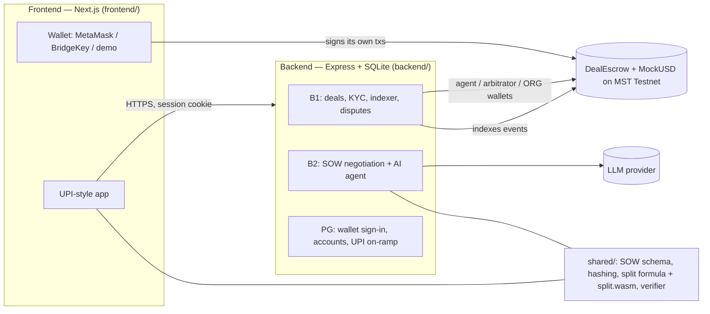

# Sakshi — AI-mediated escrow payments on MST Blockchain

**Pay anyone for work, safely.** The buyer's money is locked in an escrow smart contract on
[MST Blockchain](https://mstblockchain.com) until the work is delivered. If there's a disagreement, an AI agent
reads the agreed statement of work and the evidence and proposes a fair split, computed by an open formula
(the AI never moves money). Both parties accept it, or a human arbitrator rules. Every step can be checked on-chain.

Team **Kernel Exploits** — MST X Newrro Hackathon 2k26 · Tracks: Consumer Blockchain & Payments · DeFi & Financial
Innovation · AI & Agentic Blockchain.

---

## How it works

1. **Agree.** Either side starts an agreement with their terms; the other adds theirs. An AI agent merges both into
   one **statement of work (SOW)** with weighted, checkable deliverables and flags disagreements (e.g. the deadline)
   for the two sides to settle. Both sign the SOW's hash with their device key.
2. **Commit on-chain.** The buyer calls `proposeDeal` and the seller `acceptDeal` with the same SOW hash on the
   `DealEscrow` contract.
3. **Pay.** The buyer pays by (mock) UPI; the platform mints MockUSD stablecoins and funds the escrow.
4. **Deliver.** The seller uploads the work; its hash goes on-chain with `markDelivered`. The buyer releases the money,
   or it releases itself when the review window ends.
5. **Dispute (optional).** The buyer raises a dispute with evidence. The AI agent scores each acceptance criterion;
   the refund share is computed by code (`buyerBps = Σ weight × (100 − fulfilled%) / 100`, also shipped as WASM) and
   proposed on-chain with a hash of the full reasoning. Both accept → settled; otherwise a human arbitrator rules.
6. **Verify.** Anyone can recompute the reasoning hash and the split in the browser and compare with the chain.

Why a blockchain: two parties who don't trust each other (or the platform) need a neutral holder of the money, proof
that both agreed to the *same* SOW, and a public, tamper-evident record of every ruling and payout.

## Architecture



| On-chain (MST) | Off-chain |
|---|---|
| Escrowed MockUSD, deal status, parties, amount, deadlines | Draft negotiation, SOW text, AI reasoning JSON |
| SOW / delivery / evidence / reasoning **hashes** | Uploaded files, KYC documents, names and phone numbers |
| KYC boolean per wallet | Sessions, device binding, security PIN (hashed) |

No personal data goes on-chain — only hashes, addresses, amounts and the KYC flag.

## Repository

```
backend/      Express API (TypeScript, run with tsx): routes, chain clients, event indexer, SQLite
  src/sow/      B2 — /drafts/* negotiation, SOW store, /deals/:id/{sow,verify}
  src/agent/    B2 — LLM SOW merge + dispute scoring (Groq / Gemini / Anthropic / OpenRouter)
  src/routes/   B1 — deals, KYC, disputes, arbitration
  src/auth.ts   PG — wallet sign-in (EIP-4361-style) and sessions; src/payments/ — UPI on-ramp
  src/accounts.ts  device binding, security PIN, profile, people
frontend/     Next.js 16 app (runs without the backend against its built-in mock backend)
shared/       Code both sides must run identically: SOW schema, hashSow/hashJson, split formula, split.wasm, verifyRuling
contracts/    DealEscrow.sol + MockUSD.sol (Foundry)
docs/         API.md (interfaces), MVP.md (design), DEPLOY.md, TEAM_ROADMAP.md, STATUS.md, progress/ logs
deploy/       Caddyfile (HTTPS reverse proxy)
```

## Quick start (local)

Requirements: Node.js 22, npm. Ports: **backend 5000, frontend 3000**.

**Frontend only (mock backend, no chain or keys needed):**
```bash
cd frontend && npm ci && npm run dev        # http://localhost:3000
```

**Full stack:**
```bash
cd shared && npm ci                         # first: backend and frontend import it
cd ../backend && npm ci
cp .env.example .env                        # fill contract addresses, wallet keys, an LLM key, secrets
npm run dev                                 # http://localhost:5000
cd ../frontend && npm ci
cp .env.example .env.local                  # NEXT_PUBLIC_API_URL=http://localhost:5000, NEXT_PUBLIC_LIVE_ENDPOINTS=*
npm run dev
```
Without an LLM key, set `AGENT_DEMO_FALLBACK=true` in `backend/.env` (demo only). Contract addresses come from
`deployments.md`.

**Checks** (the same ones CI runs on every PR):
```bash
cd shared && npm test && npm run typecheck
cd backend && npm test && npm run typecheck
cd frontend && npx eslint . && npm run build
```

## Deploy

Docker Compose with Caddy (automatic HTTPS) — see **[docs/DEPLOY.md](docs/DEPLOY.md)**. The backend refuses to start
in production with an unsafe configuration.

## Security

See **[SECURITY.md](SECURITY.md)**: wallet-signed sessions, on-chain party checks on every deal action, admin/arbitrator
separation, rate limits, upload limits, CSP, and what is not covered.

## Team

| Role | Owns |
|---|---|
| **B1** — chain & data | contracts, deals, KYC, indexer, disputes, arbitration |
| **B2** — AI agent & SOW | SOW negotiation, AI merge + dispute scoring, `shared/`, verification |
| **PG** — payment gateway | wallet sign-in, sessions, UPI on-ramp, gas drip |
| **FE** — frontend | the app |

Interfaces: [docs/API.md](docs/API.md) · Design: [docs/MVP.md](docs/MVP.md) · Status: [docs/STATUS.md](docs/STATUS.md) ·
Hackathon briefing (rules, judging, MST network details): [docs/HACKATHON.md](docs/HACKATHON.md) · AI coding agents:
[AGENTS.md](AGENTS.md).

## MST Testnet

| | |
|---|---|
| Chain ID | `91562037` |
| RPC | `https://testnetrpc.mstblockchain.com` · `wss://testnetrpc.mstblockchain.com` |
| Explorer | https://testnet.mstscan.com |
| Gas token | tMSTC (18 decimals) |
